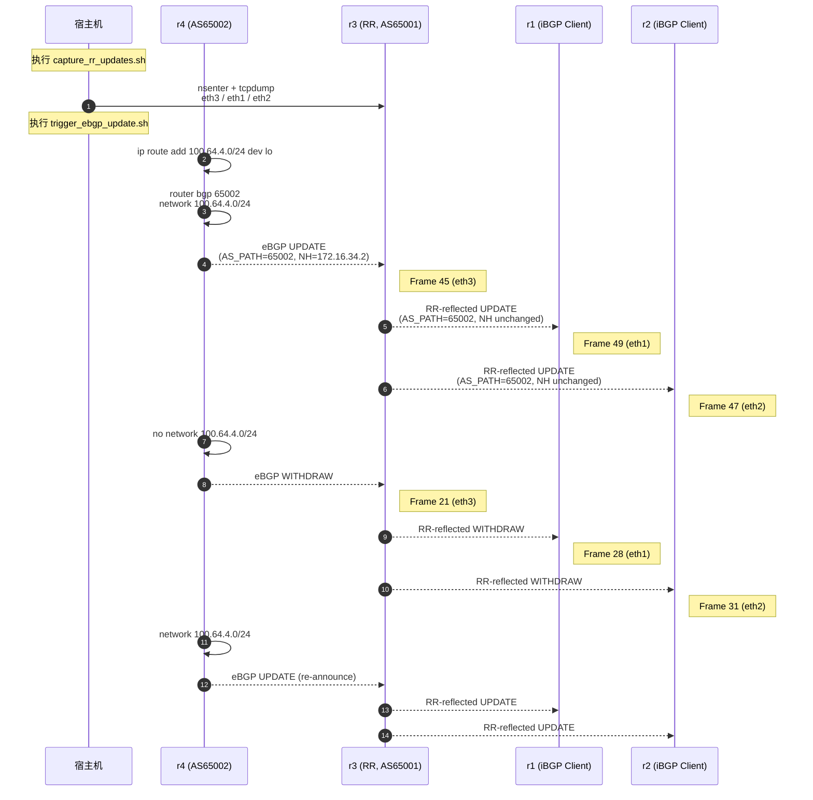

# Verification – Control Plane Packet Capture

本文件记录 **01_egp_igp_rr** 实验中对控制平面行为的抓包验证过程，用于证明：

- iBGP 会话真实建立（非“show 命令假象”）
- Route Reflector 的反射行为在报文层面存在
- OSPF 与 BGP 控制面流量路径符合设计预期

---

## 验证目标

通过抓包验证以下事实：

1. **iBGP TCP 会话存在**
   - TCP/179 三次握手完成
   - Keepalive 报文周期性交换

2. **RR 控制平面真实转发**
   - RR 接收来自 eBGP 邻居的 UPDATE
   - RR 向 iBGP Client 发送反射后的 UPDATE / Keepalive

3. **控制面流量路径正确**
   - iBGP 基于 Loopback 建立
   - 报文实际经对应接口进出

---

## 抓包位置选择

### 选择节点

- **节点**：`r3`
- **原因**：
  - r3 同时承担：
    - iBGP RR
    - eBGP 边界
  - 所有关键控制面流量必经 r3

### 选择接口

- 示例接口：`eth1`
- 对应连接：
  - r3 ↔ r1（iBGP Client）

---

## 容器网络命名空间定位

### 获取容器 PID

```bash
docker inspect -f '{{.State.Pid}}' clab-egp-igp-rr-r3
```

示例输出：

```
223667
```

### 查看命名空间内接口

```bash
sudo nsenter -t 223667 -n ip link
```

示例输出（节选）：

```
574: eth1@if575: <BROADCAST,MULTICAST,UP,LOWER_UP>
578: eth2@if579: <BROADCAST,MULTICAST,UP,LOWER_UP>
567: eth3@if568: <BROADCAST,MULTICAST,UP,LOWER_UP>
```

> ⚠️ 说明
>
> * `eth1` 是 **容器内接口名**
> * `if575` 是宿主机侧 veth，不可直接在宿主机抓包

---

## 抓包命令（正确方式）

### 在容器网络命名空间内抓包

```bash
sudo nsenter -t 223667 -n \
  tcpdump -i eth1 -nn -vvv '(ip proto 89) or (tcp port 179)'
```

* `ip proto 89` → OSPF
* `tcp port 179` → BGP
* `-nn` → 不解析端口/地址
* `-vvv` → 最大详细度

---

## 抓包结果分析

### iBGP Keepalive 报文

示例抓包输出：

```
IP 1.1.1.1.179 > 3.3.3.3.41927: Flags [P.], length 19: BGP
    Keepalive Message (4), length: 19

IP 3.3.3.3.41927 > 1.1.1.1.179: Flags [P.], length 19: BGP
    Keepalive Message (4), length: 19
```

#### 结论

* TCP 会话 **双向存在**
* Keepalive 报文周期性交换
* iBGP 会话真实建立并保持

---

### RR ↔ eBGP 邻居会话验证

在 r3 与 r4 连接接口（`eth3`）抓包可观察到：

* TCP/179 建立
* UPDATE / Keepalive 交互
* BGP Open 后进入 Established

（此处略去重复输出）

---

## 与 show 命令的交叉验证

### 控制面状态

```bash
vtysh -c "show bgp summary"
```

示例：

```
Neighbor        AS      State/PfxRcd
1.1.1.1         65001   Connect
2.2.2.2         65001   Connect
172.16.34.2     65002   Established
```

### 报文层面结论

* 抓包中 **确实存在 TCP/179 流量**
* 与 BGP FSM 状态一致
* 排除 “配置存在但进程未通信” 的假象

---

## 关键结论

1. **抓包证明 BGP 是真实运行的**

   * 非 vtysh 模拟或缓存状态

2. **Route Reflector 行为可被报文层观察**

   * RR 接收 / 发送 Keepalive
   * UPDATE 可在对应接口捕获

3. **实验环境可用于更复杂控制面实验**

   * EVPN
   * 多 RR
   * 多 AFI/SAFI

---

## 后续可扩展验证

* 抓取 **BGP UPDATE** 内容并解析 NLRI / Path Attributes
* 对比 RR 反射前后的 AS_PATH / NEXT_HOP
* 在 iBGP Client 接口抓包，验证 UPDATE 来源变化

---

下一步：

- 🔹 把 **tcpdump 抓包结果转成 Wireshark 解析要点**
- 🔹 或 **02_ibgp_evpn 的 verification.md 模板**（结构一模一样）


---

## RR UPDATE 反射行为的报文级验证（核心结论）

在确认 BGP / OSPF 控制面真实存在之后，本节进一步通过 **UPDATE 报文内容对比**，验证 Route Reflector 的反射行为是否符合 RFC 4456 定义。

---

## 验证场景说明

### 前缀注入方式

由 eBGP 邻居 **r4（AS 65002）** 通过以下方式触发 UPDATE 变化：

- 宣告前缀：`100.64.4.0/24`
- Withdraw 前缀
- 再次宣告前缀

该过程用于强制触发：

- eBGP UPDATE
- RR 接收 / 处理
- RR 向 iBGP Client 的反射 UPDATE

---

## 抓包点与方向

| 抓包接口 | 方向 | 含义 |
|------|------|------|
| r3 eth3 | r4 → r3 | eBGP 原始 UPDATE |
| r3 eth1 | r3 → r1 | RR → iBGP Client（反射） |
| r3 eth2 | r3 → r2 | RR → iBGP Client（反射） |

---

## 抓包结果分析

### 1️⃣ eBGP → RR（r4 → r3）

#### UPDATE（Advertise）

关键字段：

- **AS_PATH**：`65002`
- **NEXT_HOP**：`172.16.34.2`
- **NLRI**：`100.64.4.0/24`

说明：

- r4 作为 eBGP 邻居，正确生成原始 UPDATE
- RR 尚未参与任何路径属性修改

#### UPDATE（Withdraw）

- Withdrawn Routes：`100.64.4.0/24`
- 无 Path Attributes

符合 BGP Withdraw 报文格式规范。

---

### 2️⃣ RR → iBGP Client（r3 → r1 / r2）

#### RR 反射 Withdraw

- Withdrawn Routes：`100.64.4.0/24`
- 无 Path Attributes

说明：

- RR 对 Withdraw 报文 **不做属性加工**
- 原样反射给所有 Client

#### RR 反射 Advertise

关键字段：

- **AS_PATH**：`65002`
- **NEXT_HOP**：`172.16.34.2`
- **LOCAL_PREF**：`100`
- **NLRI**：`100.64.4.0/24`

说明：

1. RR **未在 AS_PATH 中插入自身 AS（65001）**
2. RR **未修改 NEXT_HOP**
3. RR 行为严格遵循 RFC 4456

---

### 3️⃣ RR → eBGP（对照验证）

在 r3 → r4 的方向观察到：

- **AS_PATH**：`65001 65002`
- **NEXT_HOP**：`172.16.34.1`（r3）

说明：

- AS_PATH prepend 发生在 **eBGP 出口**
- 与 RR 反射行为无关
- 这是 BGP 基本规则的体现

---

## 关键事实汇总

| 验证项 | 报文级结论 |
|----|----|
| RR 是否转发 UPDATE | 是 |
| RR 是否反射 Withdraw | 是 |
| RR 是否修改 AS_PATH | 否 |
| RR 是否修改 NEXT_HOP | 否 |
| eBGP 是否 prepend AS | 是 |
| RR 是否引入隐藏路径 | 否 |

---

## 最终结论

通过抓包可以明确确认：

1. Route Reflector 并非“逻辑抽象”
   - 其行为可被 **报文级直接观测**
2. FRRouting 的 RR 实现：
   - 与 RFC 4456 完全一致
   - 行为可预测、可验证
3. 本实验环境：
   - 具备继续开展 EVPN / 多 RR / 多 AFI 实验的可靠性

---

## 本实验验证状态

- [x] iBGP / eBGP 会话真实存在
- [x] RR 反射 UPDATE / Withdraw 经报文确认
- [x] Path Attributes 行为验证完成
- [x] 结论可重复、可审计


## RR UPDATE 报文的合并抓包与统一分析

### 抓包文件说明

为便于对 **eBGP 输入 → RR 处理 → iBGP 反射输出** 的全过程进行时序与属性对比分析，本实验将以下三个抓包文件在 Wireshark 中进行了合并（Merge）：

- `r3-eth3-ebgp.pcap`  
  - r3 ↔ r4  
  - eBGP UPDATE / Withdraw（输入到 RR）

- `r3-eth1-rr-out.pcap`  
  - r3 → r1  
  - RR 向 iBGP Client（r1）的反射 UPDATE

- `r3-eth2-rr-out.pcap`  
  - r3 → r2  
  - RR 向 iBGP Client（r2）的反射 UPDATE

合并后的文件为：

```

captures/bgp/r3-eth3-ebgp-merge-r3-eth1-and-eth2-rr-out.pcap

````

> 说明  
>
> - 合并操作仅用于 **分析与展示**
> - 不改变任何报文本身内容
> - 时间戳保持原始顺序，便于观察 RR 的处理与转发时序

---

## 抓包过滤条件

在合并后的抓包文件中，使用如下 Wireshark 显示过滤器：

```text
bgp and bgp.type != 4
````

含义：

* `bgp`：仅显示 BGP 报文
* `bgp.type != 4`：排除 Keepalive（Type 4）
* 最终仅保留：

  * UPDATE（Type 2）
  * Withdraw（Type 2，Withdrawn Routes）

该过滤条件确保分析聚焦于 **真实路由变化事件**，而非会话保活流量。

---

## RR UPDATE 报文处理时序（脚本 + 抓包联合视图）

### 实验触发与抓包的角色分工

| 角色              | 节点      | 行为                             |
| --------------- | ------- | ------------------------------ |
| eBGP 触发源        | r4      | 注入 / 撤销 / 重注入前缀                |
| Route Reflector | r3      | 接收 eBGP UPDATE，反射至 iBGP Client |
| iBGP Client     | r1 / r2 | 接收 RR 反射 UPDATE                |
| 抓包控制            | 宿主机     | 进入 r3 netns 抓包                 |

---

### 操作脚本与执行节点对应关系

| 步骤 | 执行节点    | 执行内容                     | 目的                        |
| -- | ------- | ------------------------ | ------------------------- |
| ①  | 宿主机     | `capture_rr_updates.sh`  | 在 r3 三个接口并行抓包             |
| ②  | 宿主机     | `trigger_ebgp_update.sh` | 远程驱动 r4 产生 UPDATE         |
| ③  | r4      | `ip route + network`     | 生成 eBGP UPDATE / Withdraw |
| ④  | r3      | bgpd                     | RR 处理并反射 UPDATE           |
| ⑤  | r1 / r2 | bgpd                     | 接收 RR 反射结果                |

---

## RR 报文级时序图（UPDATE / Withdraw）

> 下图为 **一次完整的 UPDATE → Withdraw → UPDATE 周期**
> 与合并抓包文件
> `r3-eth3-ebgp-merge-r3-eth1-and-eth2-rr-out.pcap`
> **逐帧一一对应**

### Mermaid 时序图（可直接渲染）



---

## 时序图与抓包文件的对应关系说明

| 报文阶段             | 接口      | 抓包文件                  | 典型 Frame |
| ---------------- | ------- | --------------------- | -------- |
| eBGP UPDATE      | r3-eth3 | `r3-eth3-ebgp.pcap`   | Frame 45 |
| RR → r1 UPDATE   | r3-eth1 | `r3-eth1-rr-out.pcap` | Frame 49 |
| RR → r2 UPDATE   | r3-eth2 | `r3-eth2-rr-out.pcap` | Frame 47 |
| eBGP Withdraw    | r3-eth3 | 同上                    | Frame 21 |
| RR Withdraw → r1 | r3-eth1 | 同上                    | Frame 28 |
| RR Withdraw → r2 | r3-eth2 | 同上                    | Frame 31 |

---

## 关键观察点（与时序图对应）

1. **UPDATE 与 Withdraw 在 RR 处呈现严格的一进多出**
2. **RR 不重写 AS_PATH / NEXT_HOP**
3. **iBGP Client 接收顺序与 RR 处理顺序一致**
4. **脚本触发 → 报文生成 → RR 反射 → 抓包证据** 构成完整因果链

---

## 方法论结论

> 本实验通过
> **“脚本驱动控制面变化 + RR 三接口并行抓包 + 合并分析”**
> 建立了一个 **可复现、可扩展、可迁移** 的 RR 行为验证方法。

该方法可直接复用于：

* 多 RR 拓扑
* EVPN Route-Type 抓包
* iBGP Policy / Route-Map 验证
* BGP Attribute 改写实验

---

## UPDATE / Withdraw 报文序列分析

### 一、eBGP → RR（r4 → r3，eth3）

#### Withdraw 报文（示例：Frame 21）

* Src → Dst：`172.16.34.2 → 172.16.34.1`
* Withdrawn Routes：

  * `100.64.4.0/24`
* Path Attributes：无

结论：

* eBGP 邻居 r4 明确撤销此前通告的前缀
* 报文格式符合 BGP Withdraw 规范

---

#### Advertise 报文（示例：Frame 45）

关键 Path Attributes：

* **ORIGIN**：IGP
* **AS_PATH**：`65002`
* **NEXT_HOP**：`172.16.34.2`
* **MED**：0
* **NLRI**：`100.64.4.0/24`

结论：

* r4 作为 AS 65002 的边界路由器，生成原始 eBGP UPDATE
* RR 尚未对路径属性产生任何影响

---

### 二、RR → iBGP Client（r3 → r1 / r2）

#### RR 反射 Withdraw（示例：Frame 28 / Frame 31）

* Src → Dst：

  * `3.3.3.3 → 1.1.1.1`
  * `3.3.3.3 → 2.2.2.2`
* Withdrawn Routes：

  * `100.64.4.0/24`
* Path Attributes：无

结论：

* RR 对 Withdraw 报文 **不进行属性修改**
* 原样反射给所有 iBGP Client
* 行为符合 RFC 4271 / RFC 4456 预期

---

#### RR 反射 Advertise（示例：Frame 47 / Frame 49）

关键 Path Attributes（r1 / r2 完全一致）：

* **ORIGIN**：IGP
* **AS_PATH**：`65002`
* **NEXT_HOP**：`172.16.34.2`
* **LOCAL_PREF**：100
* **NLRI**：`100.64.4.0/24`

重要观察结论：

1. **AS_PATH 未插入 65001**

   * RR 不应在 iBGP 反射中修改 AS_PATH
2. **NEXT_HOP 未修改**

   * 保持 eBGP 邻居 r4 的下一跳地址
3. **LOCAL_PREF 为 RR 本地属性**

   * 属于 iBGP 范围内属性
4. r1 与 r2 接收到的 UPDATE 完全一致

   * 证明 RR 执行的是“复制 + 转发”，而非重新生成路径

---

### 三、RR → eBGP（对照验证，示例：Frame 51）

在 r3 → r4 方向观察到：

* **AS_PATH**：`65001 65002`
* **NEXT_HOP**：`172.16.34.1`

结论：

* AS_PATH prepend 发生在 **eBGP 出口**
* 与 RR 反射行为无关
* 再次验证：

  * RR 与 eBGP 的路径属性处理逻辑严格区分

---

## 与运行状态的交叉验证

### r3（Route Reflector）

* 接口地址：

  * `eth1`：10.0.13.2/30（r1）
  * `eth2`：10.0.23.2/30（r2）
  * `eth3`：172.16.34.1/30（r4）
* 路由表中存在：

  * `100.64.4.0/24 via 172.16.34.2 dev eth3 proto bgp`

`show bgp summary` 显示：

* r1 / r2（iBGP）：Established
* r4（eBGP）：Established
* Prefix 计数与抓包一致

---

### r4（eBGP 邻居）

* Loopback：

  * `100.64.4.1/32`
* 本地 RIB：

  * `100.64.4.0/24 via lo`
* `show bgp summary`：

  * 仅与 r3 建立 BGP
  * 前缀收发计数正常

---

## 最终实验结论（报文级）

1. **RR 的 UPDATE / Withdraw 行为可被完整抓包验证**
2. **RR 严格遵循 RFC 4456**

   * 不修改 AS_PATH
   * 不修改 NEXT_HOP
3. **iBGP Client 接收到的 UPDATE 完全一致**
4. **eBGP 与 RR 行为在报文层清晰可区分**
5. 本实验环境具备：

   * 协议正确性
   * 报文可观测性
   * 可复现实验价值

---

> 本实验的结论并非基于 CLI 显示结果，
> 而是基于 **真实 BGP UPDATE 报文的逐字段解析**。

---

## 附1：RR 的 UPDATE / Withdraw 行为 操作记录

```text
kay@kay-vm:01_egp_igp_rr$
kay@kay-vm:01_egp_igp_rr$ sudo ./scripts/run_rr_capture_test.sh
[*] Starting RR capture + eBGP trigger test
[*] Resolving PID for clab-egp-igp-rr-r3 ...
[*] RR container PID = 223667
[*] Capture duration   = 20s
[*] Output directory   = captures/bgp

[*] Starting packet capture on RR interfaces...
tcpdump: listening on eth1, link-type EN10MB (Ethernet), capture size 262144 bytes
tcpdump: listening on eth3, link-type EN10MB (Ethernet), capture size 262144 bytes
tcpdump: listening on eth2, link-type EN10MB (Ethernet), capture size 262144 bytes
[*] Triggering eBGP UPDATE from clab-egp-igp-rr-r4
[*] Test prefix: 100.64.4.0/24

[1/4] Installing static route into RIB (required for BGP network)...
100.64.4.0/24 via 100.64.4.1 dev lo

[2/4] Advertising prefix via BGP...

[3/4] Withdrawing prefix...

[4/4] Re-advertising prefix...

[✓] eBGP UPDATE trigger completed.
[✓] Expected observations:
    - r3 eth3 : eBGP UPDATE / WITHDRAW / UPDATE
    - r3 eth1 : RR-reflected UPDATE to r1
    - r3 eth2 : RR-reflected UPDATE to r2
30 packets captured
30 packets received by filter
0 packets dropped by kernel
32 packets captured
32 packets received by filter
0 packets dropped by kernel
25 packets captured
25 packets received by filter
0 packets dropped by kernel

[✓] Capture completed.
[✓] Files generated:
    - captures/bgp/r3-eth3-ebgp.pcap   (eBGP UPDATE in)
    - captures/bgp/r3-eth1-rr-out.pcap (RR reflected to r1)
    - captures/bgp/r3-eth2-rr-out.pcap (RR reflected to r2)

[*] Open with Wireshark and compare UPDATE attributes
[✓] RR capture test completed
kay@kay-vm:01_egp_igp_rr$
kay@kay-vm:01_egp_igp_rr$
kay@kay-vm:01_egp_igp_rr$
kay@kay-vm:01_egp_igp_rr$ sudo chmod o+w -R captures/
kay@kay-vm:01_egp_igp_rr$
kay@kay-vm:01_egp_igp_rr$
kay@kay-vm:01_egp_igp_rr$
kay@kay-vm:01_egp_igp_rr$ docker exec -it clab-egp-igp-rr-r3 bash
r3:/#
r3:/#
r3:/# ip a
1: lo: <LOOPBACK,UP,LOWER_UP> mtu 65536 qdisc noqueue state UNKNOWN group default qlen 1000
    link/loopback 00:00:00:00:00:00 brd 00:00:00:00:00:00
    inet 127.0.0.1/8 scope host lo
       valid_lft forever preferred_lft forever
    inet 3.3.3.3/32 brd 3.3.3.3 scope global lo
       valid_lft forever preferred_lft forever
    inet6 ::1/128 scope host
       valid_lft forever preferred_lft forever
2: eth0@if580: <BROADCAST,MULTICAST,UP,LOWER_UP> mtu 1500 qdisc noqueue state UP group default
    link/ether 02:f7:82:0f:38:f8 brd ff:ff:ff:ff:ff:ff link-netnsid 0
    inet 172.20.20.7/24 brd 172.20.20.255 scope global eth0
       valid_lft forever preferred_lft forever
    inet6 3fff:172:20:20::7/64 scope global nodad
       valid_lft forever preferred_lft forever
    inet6 fe80::f7:82ff:fe0f:38f8/64 scope link
       valid_lft forever preferred_lft forever
567: eth3@if568: <BROADCAST,MULTICAST,UP,LOWER_UP> mtu 9500 qdisc noqueue state UP group default
    link/ether aa:c1:ab:79:64:8f brd ff:ff:ff:ff:ff:ff link-netnsid 3
    inet 172.16.34.1/30 brd 172.16.34.3 scope global eth3
       valid_lft forever preferred_lft forever
    inet6 fe80::a8c1:abff:fe79:648f/64 scope link
       valid_lft forever preferred_lft forever
574: eth1@if575: <BROADCAST,MULTICAST,UP,LOWER_UP> mtu 9500 qdisc noqueue state UP group default
    link/ether aa:c1:ab:bb:2c:7a brd ff:ff:ff:ff:ff:ff link-netnsid 1
    inet 10.0.13.2/30 brd 10.0.13.3 scope global eth1
       valid_lft forever preferred_lft forever
    inet6 fe80::a8c1:abff:febb:2c7a/64 scope link
       valid_lft forever preferred_lft forever
578: eth2@if579: <BROADCAST,MULTICAST,UP,LOWER_UP> mtu 9500 qdisc noqueue state UP group default
    link/ether aa:c1:ab:e2:10:8d brd ff:ff:ff:ff:ff:ff link-netnsid 2
    inet 10.0.23.2/30 brd 10.0.23.3 scope global eth2
       valid_lft forever preferred_lft forever
    inet6 fe80::a8c1:abff:fee2:108d/64 scope link
       valid_lft forever preferred_lft forever
r3:/#
r3:/#
r3:/# ip r
default via 172.20.20.1 dev eth0
1.1.1.1 nhid 29 via 10.0.13.1 dev eth1 proto ospf metric 20
2.2.2.2 nhid 31 via 10.0.23.1 dev eth2 proto ospf metric 20
4.4.4.4 nhid 27 via 172.16.34.2 dev eth3 proto bgp metric 20
10.0.13.0/30 dev eth1 proto kernel scope link src 10.0.13.2
10.0.23.0/30 dev eth2 proto kernel scope link src 10.0.23.2
100.64.4.0/24 nhid 27 via 172.16.34.2 dev eth3 proto bgp metric 20
172.16.34.0/30 dev eth3 proto kernel scope link src 172.16.34.1
172.20.20.0/24 dev eth0 proto kernel scope link src 172.20.20.7
r3:/#
r3:/#
r3:/# vtysh -c 'show bgp summary'

IPv4 Unicast Summary:
BGP router identifier 3.3.3.3, local AS number 65001 VRF default vrf-id 0
BGP table version 9
RIB entries 9, using 1152 bytes of memory
Peers 3, using 50 KiB of memory

Neighbor        V         AS   MsgRcvd   MsgSent   TblVer  InQ OutQ  Up/Down State/PfxRcd   PfxSnt Desc
r1(1.1.1.1)     4      65001      4180      4188        9    0    0 03:28:52            1        5 FRRouting/10.5.0_git
r2(2.2.2.2)     4      65001      4181      4189        9    0    0 03:28:53            1        5 FRRouting/10.5.0_git
r4(172.16.34.2) 4      65002      4204      4204        9    0    0 03:29:37            2        5 FRRouting/10.5.0_git

Total number of neighbors 3
r3:/#
r3:/#
r3:/# exit
exit
kay@kay-vm:01_egp_igp_rr$
kay@kay-vm:01_egp_igp_rr$
kay@kay-vm:01_egp_igp_rr$
kay@kay-vm:01_egp_igp_rr$
kay@kay-vm:01_egp_igp_rr$ docker exec -it clab-egp-igp-rr-r4 bash
r4:/#
r4:/#
r4:/# ip a
1: lo: <LOOPBACK,UP,LOWER_UP> mtu 65536 qdisc noqueue state UNKNOWN group default qlen 1000
    link/loopback 00:00:00:00:00:00 brd 00:00:00:00:00:00
    inet 127.0.0.1/8 scope host lo
       valid_lft forever preferred_lft forever
    inet 4.4.4.4/32 brd 4.4.4.4 scope global lo
       valid_lft forever preferred_lft forever
    inet 100.64.4.1/32 scope global lo
       valid_lft forever preferred_lft forever
    inet6 ::1/128 scope host
       valid_lft forever preferred_lft forever
2: eth0@if565: <BROADCAST,MULTICAST,UP,LOWER_UP> mtu 1500 qdisc noqueue state UP group default
    link/ether 56:4a:68:55:39:1d brd ff:ff:ff:ff:ff:ff link-netnsid 0
    inet 172.20.20.2/24 brd 172.20.20.255 scope global eth0
       valid_lft forever preferred_lft forever
    inet6 3fff:172:20:20::2/64 scope global nodad
       valid_lft forever preferred_lft forever
    inet6 fe80::544a:68ff:fe55:391d/64 scope link
       valid_lft forever preferred_lft forever
568: eth3@if567: <BROADCAST,MULTICAST,UP,LOWER_UP> mtu 9500 qdisc noqueue state UP group default
    link/ether aa:c1:ab:ec:5f:73 brd ff:ff:ff:ff:ff:ff link-netnsid 3
    inet 172.16.34.2/30 brd 172.16.34.3 scope global eth3
       valid_lft forever preferred_lft forever
    inet6 fe80::a8c1:abff:feec:5f73/64 scope link
       valid_lft forever preferred_lft forever
570: eth1@if569: <BROADCAST,MULTICAST,UP,LOWER_UP> mtu 9500 qdisc noqueue state UP group default
    link/ether aa:c1:ab:7e:99:8f brd ff:ff:ff:ff:ff:ff link-netnsid 1
    inet 172.16.45.1/30 brd 172.16.45.3 scope global eth1
       valid_lft forever preferred_lft forever
    inet6 fe80::a8c1:abff:fe7e:998f/64 scope link
       valid_lft forever preferred_lft forever
572: eth2@if571: <BROADCAST,MULTICAST,UP,LOWER_UP> mtu 9500 qdisc noqueue state UP group default
    link/ether aa:c1:ab:5d:76:f3 brd ff:ff:ff:ff:ff:ff link-netnsid 2
    inet 172.16.46.1/30 brd 172.16.46.3 scope global eth2
       valid_lft forever preferred_lft forever
    inet6 fe80::a8c1:abff:fe5d:76f3/64 scope link
       valid_lft forever preferred_lft forever
r4:/#
r4:/#
r4:/# ip r
default via 172.20.20.1 dev eth0
1.1.1.1 nhid 26 via 172.16.34.1 dev eth3 proto bgp metric 20
2.2.2.2 nhid 26 via 172.16.34.1 dev eth3 proto bgp metric 20
3.3.3.3 nhid 26 via 172.16.34.1 dev eth3 proto bgp metric 20
100.64.4.0/24 via 100.64.4.1 dev lo
172.16.34.0/30 dev eth3 proto kernel scope link src 172.16.34.2
172.16.45.0/30 dev eth1 proto kernel scope link src 172.16.45.1
172.16.46.0/30 dev eth2 proto kernel scope link src 172.16.46.1
172.20.20.0/24 dev eth0 proto kernel scope link src 172.20.20.2
r4:/#
r4:/# vtysh -c 'show bgp summary'

IPv4 Unicast Summary:
BGP router identifier 4.4.4.4, local AS number 65002 VRF default vrf-id 0
BGP table version 9
RIB entries 9, using 1152 bytes of memory
Peers 1, using 17 KiB of memory

Neighbor        V         AS   MsgRcvd   MsgSent   TblVer  InQ OutQ  Up/Down State/PfxRcd   PfxSnt Desc
r3(172.16.34.1) 4      65001      4256      4257        9    0    0 03:32:14            3        5 FRRouting/10.5.0_git

Total number of neighbors 1
r4:/#
r4:/#
r4:/# exit
exit
kay@kay-vm:01_egp_igp_rr$
kay@kay-vm:01_egp_igp_rr$
kay@kay-vm:01_egp_igp_rr$
kay@kay-vm:01_egp_igp_rr$
kay@kay-vm:01_egp_igp_rr$
kay@kay-vm:01_egp_igp_rr$
kay@kay-vm:01_egp_igp_rr$ tree
.
├── analysis
│   ├── analysis.md
│   └── notes.md
├── captures
│   ├── bgp
│   │   ├── r3-eth1-rr-out.pcap
│   │   ├── r3-eth2-rr-out.pcap
│   │   ├── r3-eth3-ebgp-merge-r3-eth1-and-eth2-rr-out.pcap
│   │   └── r3-eth3-ebgp.pcap
│   ├── cap_r3.pcap
│   └── ospf
├── configs
│   ├── r1
│   │   ├── daemons
│   │   ├── frr.conf
│   │   └── vtysh.conf
│   ├── r2
│   │   ├── daemons
│   │   ├── frr.conf
│   │   └── vtysh.conf
│   ├── r3
│   │   ├── daemons
│   │   ├── frr.conf
│   │   └── vtysh.conf
│   ├── r4
│   │   ├── daemons
│   │   ├── frr.conf
│   │   └── vtysh.conf
│   ├── r5
│   │   ├── daemons
│   │   ├── frr.conf
│   │   └── vtysh.conf
│   └── r6
│       ├── daemons
│       ├── frr.conf
│       └── vtysh.conf
├── diagrams
│   ├── control-plane
│   │   └── control-plane.puml
│   ├── sequence
│   │   └── sequence.puml
│   └── topology
│       └── topology.puml
├── README.md
├── results
│   └── verification.md
├── scripts
│   ├── capture_rr_updates.sh
│   ├── run_rr_capture_test.sh
│   └── trigger_ebgp_update.sh
└── topo
    ├── address-plan.md
    ├── clab-egp-igp-rr
    │   ├── ansible-inventory.yml
    │   ├── authorized_keys
    │   ├── graph
    │   │   └── topo.mermaid
    │   ├── nornir-simple-inventory.yml
    │   └── topology-data.json
    └── topo.yml

20 directories, 40 files
kay@kay-vm:01_egp_igp_rr$
```

## 附2：合并后的UPDATE报文

```text
Frame 21: Packet, 93 bytes on wire (744 bits), 93 bytes captured (744 bits)
Ethernet II, Src: aa:c1:ab:ec:5f:73 (aa:c1:ab:ec:5f:73), Dst: aa:c1:ab:79:64:8f (aa:c1:ab:79:64:8f)
Internet Protocol Version 4, Src: 172.16.34.2, Dst: 172.16.34.1
Transmission Control Protocol, Src Port: 179, Dst Port: 52172, Seq: 39, Ack: 39, Len: 27
Border Gateway Protocol - UPDATE Message
    Marker: ffffffffffffffffffffffffffffffff
    Length: 27
    Type: UPDATE Message (2)
    Withdrawn Routes Length: 4
    Withdrawn Routes
        100.64.4.0/24
            Withdrawn route prefix length: 24
            Withdrawn prefix: 100.64.4.0
    Total Path Attribute Length: 0

Frame 28: Packet, 93 bytes on wire (744 bits), 93 bytes captured (744 bits)
Ethernet II, Src: aa:c1:ab:bb:2c:7a (aa:c1:ab:bb:2c:7a), Dst: aa:c1:ab:c2:97:b1 (aa:c1:ab:c2:97:b1)
Internet Protocol Version 4, Src: 3.3.3.3, Dst: 1.1.1.1
Transmission Control Protocol, Src Port: 41927, Dst Port: 179, Seq: 39, Ack: 39, Len: 27
Border Gateway Protocol - UPDATE Message
    Marker: ffffffffffffffffffffffffffffffff
    Length: 27
    Type: UPDATE Message (2)
    Withdrawn Routes Length: 4
    Withdrawn Routes
        100.64.4.0/24
            Withdrawn route prefix length: 24
            Withdrawn prefix: 100.64.4.0
    Total Path Attribute Length: 0

Frame 30: Packet, 93 bytes on wire (744 bits), 93 bytes captured (744 bits)
Ethernet II, Src: aa:c1:ab:79:64:8f (aa:c1:ab:79:64:8f), Dst: aa:c1:ab:ec:5f:73 (aa:c1:ab:ec:5f:73)
Internet Protocol Version 4, Src: 172.16.34.1, Dst: 172.16.34.2
Transmission Control Protocol, Src Port: 52172, Dst Port: 179, Seq: 58, Ack: 85, Len: 27
Border Gateway Protocol - UPDATE Message
    Marker: ffffffffffffffffffffffffffffffff
    Length: 27
    Type: UPDATE Message (2)
    Withdrawn Routes Length: 4
    Withdrawn Routes
        100.64.4.0/24
            Withdrawn route prefix length: 24
            Withdrawn prefix: 100.64.4.0
    Total Path Attribute Length: 0

Frame 31: Packet, 93 bytes on wire (744 bits), 93 bytes captured (744 bits)
Ethernet II, Src: aa:c1:ab:e2:10:8d (aa:c1:ab:e2:10:8d), Dst: aa:c1:ab:c6:de:33 (aa:c1:ab:c6:de:33)
Internet Protocol Version 4, Src: 3.3.3.3, Dst: 2.2.2.2
Transmission Control Protocol, Src Port: 179, Dst Port: 37119, Seq: 58, Ack: 58, Len: 27
Border Gateway Protocol - UPDATE Message
    Marker: ffffffffffffffffffffffffffffffff
    Length: 27
    Type: UPDATE Message (2)
    Withdrawn Routes Length: 4
    Withdrawn Routes
        100.64.4.0/24
            Withdrawn route prefix length: 24
            Withdrawn prefix: 100.64.4.0
    Total Path Attribute Length: 0

Frame 45: Packet, 121 bytes on wire (968 bits), 121 bytes captured (968 bits)
Ethernet II, Src: aa:c1:ab:ec:5f:73 (aa:c1:ab:ec:5f:73), Dst: aa:c1:ab:79:64:8f (aa:c1:ab:79:64:8f)
Internet Protocol Version 4, Src: 172.16.34.2, Dst: 172.16.34.1
Transmission Control Protocol, Src Port: 179, Dst Port: 52172, Seq: 104, Ack: 104, Len: 55
Border Gateway Protocol - UPDATE Message
    Marker: ffffffffffffffffffffffffffffffff
    Length: 55
    Type: UPDATE Message (2)
    Withdrawn Routes Length: 0
    Total Path Attribute Length: 28
    Path attributes
        Path Attribute - ORIGIN: IGP
            Flags: 0x40, Transitive, Well-known, Complete
            Type Code: ORIGIN (1)
            Length: 1
            Origin: IGP (0)
        Path Attribute - AS_PATH: 65002 
            Flags: 0x50, Transitive, Extended-Length, Well-known, Complete
            Type Code: AS_PATH (2)
            Length: 6
            AS Path segment: 65002
        Path Attribute - NEXT_HOP: 172.16.34.2 
            Flags: 0x40, Transitive, Well-known, Complete
            Type Code: NEXT_HOP (3)
            Length: 4
            Next hop: 172.16.34.2
        Path Attribute - MULTI_EXIT_DISC: 0
            Flags: 0x80, Optional, Non-transitive, Complete
            Type Code: MULTI_EXIT_DISC (4)
            Length: 4
            Multiple exit discriminator: 0
    Network Layer Reachability Information (NLRI)
        100.64.4.0/24
            NLRI prefix length: 24
            NLRI prefix: 100.64.4.0

Frame 47: Packet, 128 bytes on wire (1024 bits), 128 bytes captured (1024 bits)
Ethernet II, Src: aa:c1:ab:e2:10:8d (aa:c1:ab:e2:10:8d), Dst: aa:c1:ab:c6:de:33 (aa:c1:ab:c6:de:33)
Internet Protocol Version 4, Src: 3.3.3.3, Dst: 2.2.2.2
Transmission Control Protocol, Src Port: 179, Dst Port: 37119, Seq: 104, Ack: 77, Len: 62
Border Gateway Protocol - UPDATE Message
    Marker: ffffffffffffffffffffffffffffffff
    Length: 62
    Type: UPDATE Message (2)
    Withdrawn Routes Length: 0
    Total Path Attribute Length: 35
    Path attributes
        Path Attribute - ORIGIN: IGP
            Flags: 0x40, Transitive, Well-known, Complete
            Type Code: ORIGIN (1)
            Length: 1
            Origin: IGP (0)
        Path Attribute - AS_PATH: 65002 
            Flags: 0x50, Transitive, Extended-Length, Well-known, Complete
            Type Code: AS_PATH (2)
            Length: 6
            AS Path segment: 65002
        Path Attribute - NEXT_HOP: 172.16.34.2 
            Flags: 0x40, Transitive, Well-known, Complete
            Type Code: NEXT_HOP (3)
            Length: 4
            Next hop: 172.16.34.2
        Path Attribute - MULTI_EXIT_DISC: 0
            Flags: 0x80, Optional, Non-transitive, Complete
            Type Code: MULTI_EXIT_DISC (4)
            Length: 4
            Multiple exit discriminator: 0
        Path Attribute - LOCAL_PREF: 100
            Flags: 0x40, Transitive, Well-known, Complete
            Type Code: LOCAL_PREF (5)
            Length: 4
            Local preference: 100
    Network Layer Reachability Information (NLRI)
        100.64.4.0/24
            NLRI prefix length: 24
            NLRI prefix: 100.64.4.0

Frame 49: Packet, 128 bytes on wire (1024 bits), 128 bytes captured (1024 bits)
Ethernet II, Src: aa:c1:ab:bb:2c:7a (aa:c1:ab:bb:2c:7a), Dst: aa:c1:ab:c2:97:b1 (aa:c1:ab:c2:97:b1)
Internet Protocol Version 4, Src: 3.3.3.3, Dst: 1.1.1.1
Transmission Control Protocol, Src Port: 41927, Dst Port: 179, Seq: 85, Ack: 58, Len: 62
Border Gateway Protocol - UPDATE Message
    Marker: ffffffffffffffffffffffffffffffff
    Length: 62
    Type: UPDATE Message (2)
    Withdrawn Routes Length: 0
    Total Path Attribute Length: 35
    Path attributes
        Path Attribute - ORIGIN: IGP
            Flags: 0x40, Transitive, Well-known, Complete
            Type Code: ORIGIN (1)
            Length: 1
            Origin: IGP (0)
        Path Attribute - AS_PATH: 65002 
            Flags: 0x50, Transitive, Extended-Length, Well-known, Complete
            Type Code: AS_PATH (2)
            Length: 6
            AS Path segment: 65002
        Path Attribute - NEXT_HOP: 172.16.34.2 
            Flags: 0x40, Transitive, Well-known, Complete
            Type Code: NEXT_HOP (3)
            Length: 4
            Next hop: 172.16.34.2
        Path Attribute - MULTI_EXIT_DISC: 0
            Flags: 0x80, Optional, Non-transitive, Complete
            Type Code: MULTI_EXIT_DISC (4)
            Length: 4
            Multiple exit discriminator: 0
        Path Attribute - LOCAL_PREF: 100
            Flags: 0x40, Transitive, Well-known, Complete
            Type Code: LOCAL_PREF (5)
            Length: 4
            Local preference: 100
    Network Layer Reachability Information (NLRI)
        100.64.4.0/24
            NLRI prefix length: 24
            NLRI prefix: 100.64.4.0

Frame 51: Packet, 118 bytes on wire (944 bits), 118 bytes captured (944 bits)
Ethernet II, Src: aa:c1:ab:79:64:8f (aa:c1:ab:79:64:8f), Dst: aa:c1:ab:ec:5f:73 (aa:c1:ab:ec:5f:73)
Internet Protocol Version 4, Src: 172.16.34.1, Dst: 172.16.34.2
Transmission Control Protocol, Src Port: 52172, Dst Port: 179, Seq: 104, Ack: 159, Len: 52
Border Gateway Protocol - UPDATE Message
    Marker: ffffffffffffffffffffffffffffffff
    Length: 52
    Type: UPDATE Message (2)
    Withdrawn Routes Length: 0
    Total Path Attribute Length: 25
    Path attributes
        Path Attribute - ORIGIN: IGP
            Flags: 0x40, Transitive, Well-known, Complete
            Type Code: ORIGIN (1)
            Length: 1
            Origin: IGP (0)
        Path Attribute - AS_PATH: 65001 65002 
            Flags: 0x50, Transitive, Extended-Length, Well-known, Complete
            Type Code: AS_PATH (2)
            Length: 10
            AS Path segment: 65001 65002
        Path Attribute - NEXT_HOP: 172.16.34.1 
            Flags: 0x40, Transitive, Well-known, Complete
            Type Code: NEXT_HOP (3)
            Length: 4
            Next hop: 172.16.34.1
    Network Layer Reachability Information (NLRI)
        100.64.4.0/24
            NLRI prefix length: 24
            NLRI prefix: 100.64.4.0

```
